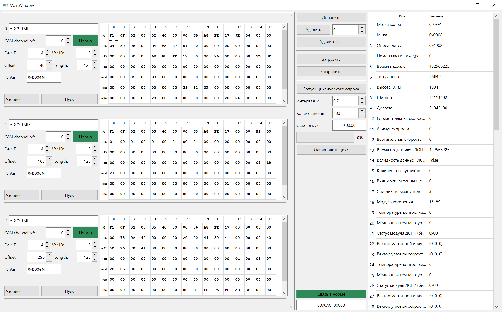
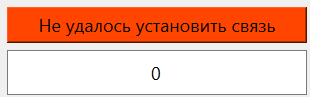

# CAN USB Software

Данный репозиторий содержит пакет программ, предназначенных для общения по CAN-шине с устройствами, основанными на STM32.С "железной" стороны используются USB-CAN преобразователь и библиотеки CANLib2, разработанные в ОАИ НГУ.

## Использование

Перед использованием необходимо ввести ID CAN-моста, используемого для общения с устройством. Далее установить соединение. При успешном соединении соответствующая кнопка будет выделена зеленым цветом. Иначе - красным:




Далее можно добавлять/удалять блоки чтения различных переменных. В каждом блоке можно установить свой номер устройства (dev_id) и вычитываемой/записываемой переменной (var_id, от 0 до 14), а также смещение внутри самой переменной (offset) и количество даннх для чтения/записи (length).

Для удобства реализована навигация с помощью клавиши **`Tab`**. Сначала по порядку переключаются центральные клавиши, затем клавиши в блоках чтения переменных, во всх блоках по порядку, сверху вниз.

Если в какой-то момент времени пользоваель находится в редактировании настроек одного из блоков чтения - нажатием клавиш **`Ctrl+Space`** начинается чтение данных текущего(редактируемого) блока.

Если фокус устаовленн на окне программы (в любом её месте), то нажатием клавиш **`Ctrl+Space`** осуществляется переподключение к CAN-мосту.

## Установка

Для установки используются [git](https://github.com/) и менеджер пакетов [pip](https://pip.pypa.io/en/stable/).

**`Bash`**:
```bash
git clone https://github.com/CuSynth/can_usb_software.git
cd ./can_usb_software/ && python -m venv .venv && source .venv/Scripts/activate && python -m pip install -r requirements.txt
```

**`PowerShell`** (в том числе, терминал VsCode):
```powershell
git clone https://github.com/CuSynth/can_usb_software.git
cd ./can_usb_software/
python -m venv .venv
.venv/Scripts/activate
python -m pip install -r requirements.txt
```


## Запуск
Запустить файл **`can_unit.py`** из VsCode или из консоли:

**`Bash`**:
```bash
source .venv/Scripts/activate
python can_unit.py
```
**`PowerShell`** (в том числе, терминал VsCode):
```powershell
.venv/Scripts/activate
python can_unit.py
```

